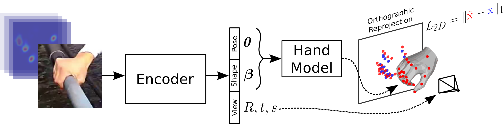

# 3D Hand Shape and Pose from Images in the Wild
Adnane Boukhayma, Rodrigo de Bem, Philip H.S. Torr, 
[CVPR 2019 (Oral)](https://arxiv.org/abs/1902.03451)



## PCK curves
We provide scripts and data to plot 3D & 2D PCK curves in figures 4,5,6,7,8 of the paper in directory `PCK`. We use [gnuplot](http://www.gnuplot.info/) for plotting the figures. For example:
```
cd PCK/dataset
./figx
```
where `dataset` is one of `{stereo, egodexter, dexter+object, mpii+nzsl}` and `figx` is one of `{fig4,5,6,7,8}`. 


## Requirements
+ Python 2.7
+ PyTorch 0.3
+ [MANO](http://mano.is.tue.mpg.de/) 

## Testing
Download the model weights. Put model-0.pth and model-1.pth in directory `data`.
```
https://drive.google.com/file/d/1Ar9gUuq1kpVUUOlGsuOqfeiyv2GdixS9
https://drive.google.com/file/d/135Ka6XQVcFBGTLyVu1D0dzXOcc-0XNao
```
Run the following command to test our method on cropped image examples in `data/cropped`. 
```
python tester.py
```
Our resnet+Mano model in implemented in `model.py`.

## Data preprocessing
Input images are assumed to be crops of fixed size around the hand. Using this command, we find the tightest rectangular box of edge size
l containing the hand. Images are then cropped with a square patch of size 2.2xl. Input images are located in `data/original` and cropped images are saved in `data/cropped`.
```
python crop.py
```
This command generates the 2D joint heat map images used as additional input to our network. You will need to build [PyOpenPose](https://github.com/FORTH-ModelBasedTracker/PyOpenPose). 
```
python heatmap.py
```
This command generates hand image segmentations using 2D joint locations and GrabCut. 
```
python segment.py
``` 
 
## Synthetic data creation
This command colors registered meshes in `data/meshes_registered` using their colored corresponding unregistered meshes in `data/meshes_unregistered`. Results are saved in `data/meshes_colored`.         
```
python create_colored_meshes.py
```
Using mesh colour instances in `data/meshes_colored`, background images in `data/backgrounds`, and sampling global poses and geometries from MANO, this command creates synthetic image examples. 
```
python create_synthetic_data.py
```


## Citation
    @inproceedings{boukhayma20193d,
      title={3d hand shape and pose from images in the wild},
      author={Boukhayma, Adnane and Bem, Rodrigo de and Torr, Philip HS},
      booktitle={Proceedings of the IEEE Conference on Computer Vision and Pattern Recognition},
      pages={10843--10852},
      year={2019}
    }

## Acknowledgement
This work was supported by the ERC grant ERC-2012-AdG 321162-HELIOS, the EPSRC grant Seebibyte EP/M013774/1 and the EPSRC/MURI grant EP/N019474/1.

## License
<a rel="license" href="http://creativecommons.org/licenses/by-nc/4.0/"></a><br />This work is licensed under a <a rel="license" href="http://creativecommons.org/licenses/by-nc/4.0/">Creative Commons Attribution-NonCommercial 4.0 International License</a>.
